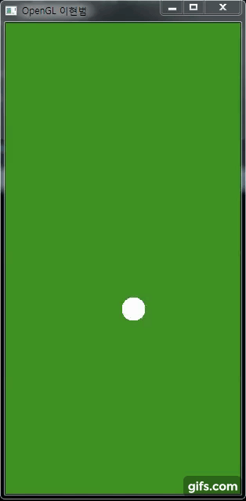

# OpenGL
###1. 당구공 움직임 애니메이션

***

###1.당구공 움직임 애니메이션

1. 문제 정의 
    Java GUI 와 Event 를 활용하여 계산기 프로그램을 개발합니다. 
    GUI를 사용하여 계산기의 기능을 하는 버튼을 제작하고, 디자인을 합니다.  
    그리고 일반적인 계산기 동작이 가능하도록 개발하고, 연속적으로 이전 결과값을 사용하여 계산할 수 있도록 개발합니다.  
    마지막으로 초기화 기능을 개발하는 것이 문제입니다. 

2. 해결 과정 
    입사각과 반사각의 원리를 적용하기 위해서 우선 원의 방향을 정했습니다. 
    각 x, y축의 대각선 방향으로 4가지입니다. 
    방향이 전환 되는 시점은 각 x축과 y축의 최대치와 최고치를 넘어갔을 때, 방향을 변환했습니다. 
    방향 설정은 “입사각 = 반사각” 원리를 적용해서 x축 최대치를 넘어가면 x값에 -1를 곱하여 방향을 바꾸고, 
    x축 최소치를 넘어가면 다시 x값에 -1를 곱하여 방향을 바꿨습니다.  
    같은 방법으로 y축 또한 방향을 정하였습니다. 

 
***

