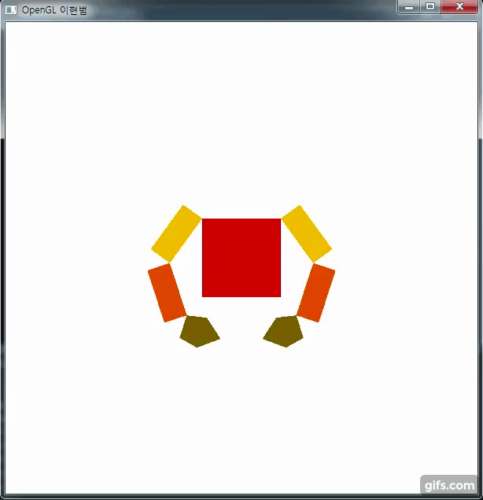

# OpenGL
###1. 당구공 움직임 애니메이션

***

###1.당구공 움직임 애니메이션
1. 해결 과정 
    입사각과 반사각의 원리를 적용하기 위해서 우선 원의 방향을 정했습니다. 
    각 x, y축의 대각선 방향으로 4가지입니다. 
    방향이 전환 되는 시점은 각 x축과 y축의 최대치와 최고치를 넘어갔을 때, 방향을 변환했습니다. 
    방향 설정은 “입사각 = 반사각” 원리를 적용해서 x축 최대치를 넘어가면 x값에 -1를 곱하여 방향을 바꾸고, 
    x축 최소치를 넘어가면 다시 x값에 -1를 곱하여 방향을 바꿨습니다.  
    같은 방법으로 y축 또한 방향을 정하였습니다. 

 
***

###2. 로봇팔 흔들기
1. 해결 과정 
    몸통, 어깨, 팔뚝은 직사각형이기 때문에 4개의 점을 정하는 것이 쉬웠지만,  손의 경
우 5각형으로 만들기 위해서 5개의 점을 계산 해야 했습니다.  따라서 미리 종이에 그리
고 좌표 값을 정했습니다.  처음 회전을 할 때, 어깨와 팔 그리고 손이 수평을 이루면서
부자연스럽게 움직였습니다.  그래서 각각 GoToShoulderCoordinates( )함수와
GoToElbowCoordinates( )함수에 glRotatef( )함수를 추가 하였습니다.  따라서 각 객체들
이 따로 움직이면서 더 자연스러운 곡선을 그리면서 팔을 흔들게 되었습니다.  회전 각
도인 theta는 -60도에서 60도 까지 회전하도록 설계했습니다.  또한 팔이 위로 올라가고
아래로 가는 경우를 생각해서 ‘ up ’ 이라는 변수를 만들어서 현재 팔이 올라가는지 내
려가는지를 구분했고,  각도를 증가시킬지 감소시킬지를 정했습니다. 

 
***

